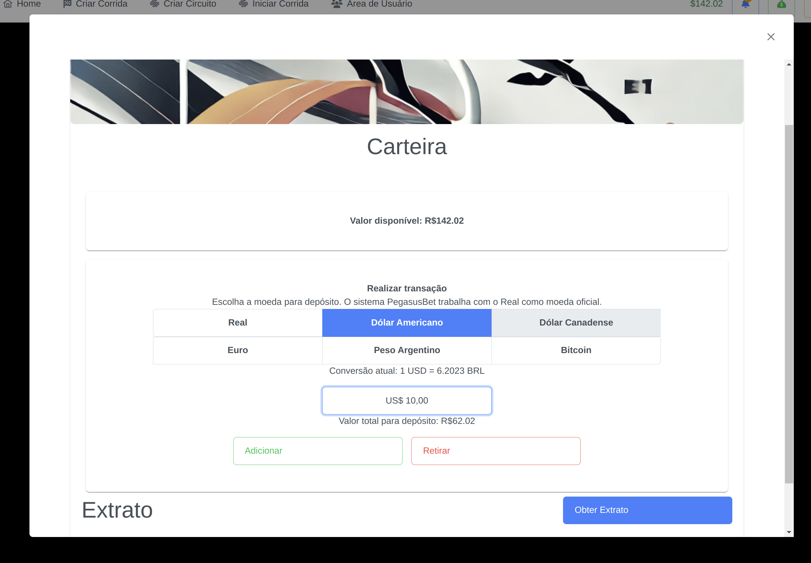

# Pegasus Bet

O PegasusBet é um sistema de apostas de cavalos.

## Apresentaçao em Vídeo

Parte 1: https://drive.google.com/file/d/1Op_xfYP4_uwUbdVxRflgENHujOZQSnoO/view?usp=sharing
Parte 2: https://drive.google.com/file/d/1j3hx5W6zP-rPZKUB5iBbeAjEiTB0W5Br/view?usp=sharing
Parte 3: https://drive.google.com/file/d/1EA3eUjod7nEkLwaSrScLLePiQb-CXm6m/view?usp=sharing

Cenário:

Um grande empresário de nome Serjão Berranteiro vem expandindo seus negócios na área de maquinário e produção agrícola. 
Uma de suas paixões são seus vários hectares de terra, onde, com frequência, ele pratica cavalgadas, ocasiões nas quais 
ele convida todos os amigos. Muitas vezes eles fazem corridas com os cavalos e apostam determinados valores. 
Observando a diversão dos companheiros e vendo que muitas pessoas curtiam os vídeos que ele ocasionalmente publicava 
nas redes sociais, o empresário decidiu montar o próprio negócio de apostas em cavalos online.

## Requisitos

### Informações das Corridas
Devem ser disponibilizadas informações tais como data de corridas, banca de apostas, 
corridas em execução. 

Solução: tela contendo informações das corridas, podendo serem aplicados dois filtros:
* Mostrar apenas corridas que o usuário apostou e/ou
* Mostrar apenas corridas que estão aceitando apostas (não finalizadas)

Os cards das corridas são expansíveis, podendo visualizar o line-up da corrida com os cavalos e jockeys e as odds respectivas.

Ao clicar em um cavalo ou jockey as suas informações poderão ser visualizadas.

### Realizar Aposta

Ao clicar na "odd" correspondente a um cavalo / jockey, uma aba será aberta possibilitando a aposta.

São possibilitadas 3 tipos de apostas:

* WIN:
  * O cavalo escolhido deverá finalizar em primeiro para o usuário ser vencedor;
  * Esta aposta está disponível em todas as corridas;
  * Oferece 100% de retorno, ou seja, com odds "2" e uma aposta no valor de R$ 10,00 o usuário terá retorno de R$ 20,00 caso o cavalo finalize em primeiro.

* PLACE:
  * O cavalo escolhido deverá finalizar em primeiro ou segundo;
  * Esta aposta está disponível apenas em corridas com mais de 5 participantes;
  * Oferece um retorno menor. O usuarío terá 30% do retorno da aposta decrescido.
  * Exemplo: Aposta de R$ 10,00 com odds de 2. O retorno de 100% seria R$ 20,00. Como a aposta é do tipo PLACE o valor ganho (R$ 10,00) terá
redução de 30%. O usuário irá receber então um depósito de  R$ 17,00.

* SHOW:
  * O cavalo escolhido deverá finalizar em primeiro, segundo ou terceiro;
  * Esta aposta está disponível apenas em corridas com mais de 9 participantes;
  * O usuário terá 50% do retorno da aposta descrescido.
  * Exemplo: Aposta de R$ 10,00 com odds de 2. Retorno de R$ 15,00

### Carteira de Verba

Para possibilitar as apostas, o usuário deverá adicionar verba em sua carteira.

O sistema aceita o depósito nas seguintes moedas:
* Real
* Dólar Americano
* Dólar Canadense
* Euro
* Peso Argentino
* Bitcoin

A cotação atual de cada moeda é obtido através da [Awesome-API](https://docs.awesomeapi.com.br/api-de-moedas).

O valor depositado ou retirado é convertido para real antes de ser persistido.

Nesta tela é possível também obter o extrato das movimentações da carteira do usuário.

### Criação de Corridas

Os usuários do tipo admin podem criar novas corridas, atribuindo os pares de cavalos e jockeys para aquela corrida,
escolher o horário e data da corrida, além do circuito em que a corrida ocorrerá.

Circuitos devem ser previamente criados.

### Simulação das Corridas

Os usuários do tipo admin possuem controle para iniciar as corridas.

Ao iniciar uma corrida, o microsserviço responsável por simular as corridas irá enviar informações sobre as posições dos
cavalos via conexão websocket, podendo a corrida ser acompanhada pelos usuários na tela "live"

### Apostas

O usuário pode acompanhar o status e o histórico de suas apostas. Após a finalização de uma corrida, o usuário receberá
uma notificação de que a corrida foi realizada.

### Crawler para obtenção de Cavalos e Jockeys e seus Resultados

O sistema possui um microsserviço responsável por realizar a varredura no site 
[Sportinglife](https://www.sportinglife.com/racing/racecards), acessando os racecards disponíveis no dia e criando
novos jockeys e cavalos no caso de eles não existirem no sistema.

O crawler pode ser disparado apenas por administradores do sistema.

A lista de cavalos e jockeys cadastrados podem ser visualizadas por todos usuários. Ao clicar em um jockey / cavalo as
informações de resultados passados serão mostradas.

A lista pode ser filtrada pelo nome.

### Autenticação

O sistema utiliza autenticação via JWT, utilizando o [plugin spring security do grails](https://grails.github.io/grails-spring-security-core/5.3.x/index.html).

A autenticação é realizada pelo microsserviço UserDataStore.

O Microsserviço PegasusBet possui um interceptor para todos os endpoints, que faz uma chamada via http para o MS PegasusDatastore
para verificar se o token enviado pelo usuário é válido.

Além disso, o front também possui route guards, impedindo usuários não logados de acessarem as áreas internas do sistema.
A modulo do administrador também utiliza route guard especifico para verificação da credencial do usuário e se este contém a role ADMIN.

## Diagrama Microsserviços

O sistema possui 4 microsserviços, sendo eles:

* PegasusDataStore (Grails v5.3.6)
  * Responsável por armazenar informações referentes a:
    * Cavalos e seus resultados
    * Jockeys e seus resultados
    * Circuitos
    * Corridas
    * Odds de cada cavalo/jockey nas corridas
* UsersDataStore (Grails v5.3.6)
  * Responsável por armazenar informações referentes a:
    * Usuários
    * Carteira dos usuários
    * Apostas
* Webcrawler (Grails v.5.3.6)
  * Responsável pelo crawler para obtençao dos dados de jockeys e cavalos
* RaceSimulation (Node.js)
  * Responsável pela simulação das corridas

A comunicação entre os microsserviços é realizada com padrão de comunicação de mensageria, utilizando o Kafka.

## Modelagem do Banco de Dados

## Site para informações das corridas

https://www.sportinglife.com/racing/racecards